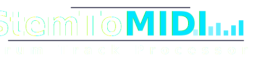

---

Audio-to-MIDI conversion for drum tracks using deep learning separation, time analysis, spectral frequency analysis and frequency energy analysis.
--- 

### Before We Begin: **LarsNet**

This project extends [LarsNet](LARSNET.md), a deep learning model for drum source separation, with intelligent MIDI generation capabilities. Many thanks to the author's hard work on that project.

## Quick Start

### Setting Up

This project runs in Docker. Install [Docker Desktop](https://www.docker.com/products/docker-desktop/), then run this in Terminal:

```bash
docker compose up -d
```

This will incur some significant downloads for tools and such. Once complete and running, you can use either:

**Option 1: Web Interface (Recommended)**
```bash
docker exec -it larsnet-midi bash
python -m webui.app
```
Then open http://localhost:49152 in your browser. See [WEBUI_SETUP.md](WEBUI_SETUP.md) for details.

**Option 2: Command Line**
```bash
docker exec -it larsnet-midi bash
```
This is where you'll execute the scripts.

## Turning Drum Tracks into MIDI

### Process Overview


### Where Do I Get A Drum Track?

There are a variety of tools available to get an isolated drum track from a complete song. I use Logic Pro's "Stem Splitting" feature.

When you have a drum track, place it in the `user_files/` directory, then run these tools in sequence:

### 1. Separate drums into stems
```bash
python separate.py
```
Separates drums into individual stems (kick, snare, hi-hat, cymbals, toms) using deep learning. The first time the tool encounters a specific song, it  will create a new project folder inside `user_files`, and move your track there.

**Having trouble with separation quality?** Use the comparison tool to test multiple configurations:
```bash
python compare_separation_configs.py
```
See [Separation Comparison Guide](SEPARATION_COMPARISON_GUIDE.md) for details.

### 2. Clean up bleed between stems (optional)
```bash
python sidechain_cleanup.py
```
This optional step removes sound from the kick drum track at the moment a snare sound is present in the snare track. It's used to remove "bleed through" of the snare which may be present in the kick track.

### 3. Convert stems to MIDI
```bash
python stems_to_midi.py
```
Detects drum hits in the stem files and converts them to a MIDI track.

It creates midi events on these "notes":
- kick 
- snare 
- hi-hat (open and closed)
- claps which often show up in the hi-hat track
- 3 toms
- cymbals

At this point, you can use the MIDI track as a replacement for the original drum track.

### 4. Render MIDI to video (optional)
```bash
python render_midi_to_video.py
```
Creates Rock Band-style falling notes visualization in an MP4 video. I view this on my phone while I play along on my Roland drum kit.

# Further Information

For deeper details on each part of the pipeline, see:

- [LarsNet research & models](LARSNET.md)
- [Separation comparison guide (test multiple configs)](SEPARATION_COMPARISON_GUIDE.md)
- [Sidechain cleanup guide (reduce bleed)](SIDECHAIN_CLEANUP_GUIDE.md)
- [Stems → MIDI guide](STEMS_TO_MIDI_GUIDE.md)
- [MIDI visualization (Rock Band-style)](MIDI_VISUALIZATION_GUIDE.md)
- [Machine learning training guide (calibrate detectors - WIP)](ML_TRAINING_GUIDE.md)
- [Dependency & environment notes](DEPENDENCIES.md)

## Contributing

See [CONTRIBUTING.md](CONTRIBUTING.md) for development guidelines.
