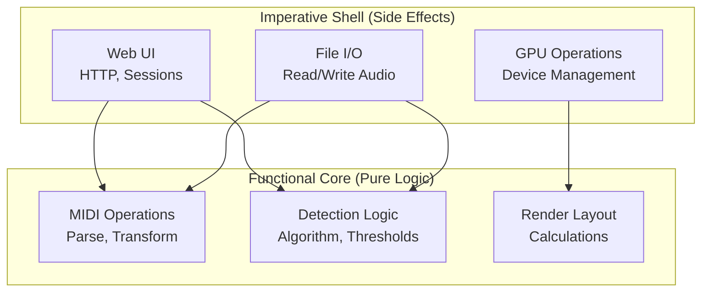

# Coding Patterns

This document describes the architectural patterns and naming conventions used throughout the DrumToMIDI codebase.

## Functional Core, Imperative Shell (FCIS)

The codebase uses the FCIS pattern to separate pure logic from side effects.



**Rule**: Shells call cores, cores never call shells. Cores are pure, testable, deterministic.

### Functional Cores

Characteristics:
- **No side effects**: No file I/O, network, database, system calls
- **Deterministic**: Same input always produces same output
- **Testable**: Unit tests without mocks, fast execution
- **Portable**: Can run anywhere, no environment dependencies

Naming: `*_core.py`, `*_types.py`

Examples:
- `midi_core.py` - MIDI operations
- `midi_render_core.py` - Layout calculations
- `analysis_core.py` - Signal processing
- `note_classification_core.py` - Classification logic
- `stereo_core.py` - Stereo processing

### Imperative Shells

Characteristics:
- **Side effects**: File I/O, network, GPU, database
- **Non-deterministic**: Depends on external state
- **Integration tests**: Tested via higher-level scenarios
- **Environment-dependent**: Requires GPU, files, network

Naming: `*_shell.py`, CLI scripts

Examples:
- `separation_shell.py` - Audio separation orchestration
- `processing_shell.py` - Detection pipeline orchestration
- `render_midi_video_shell.py` - Video rendering orchestration

## Naming Conventions

### File Naming

| Pattern | Meaning | Example |
|---------|---------|---------|
| `*_core.py` | Functional core - pure logic | `midi_core.py`, `analysis_core.py` |
| `*_shell.py` | Imperative shell - I/O orchestration | `separation_shell.py` |
| `*_types.py` | Type definitions and contracts | `midi_types.py` |
| `detection*.py` | Detection algorithms | `detection_shell.py` |
| `processing*.py` | Pipeline orchestration | `processing_shell.py` |
| `test_*.py` | Unit tests | `test_midi_core.py` |
| `*_test.py` | Package tests | `stems_to_midi/test_analysis_core.py` |

### Module Naming

| Pattern | Meaning | Example |
|---------|---------|---------|
| `stems_to_midi/` | Detection and MIDI conversion | Core business logic |
| `moderngl_renderer/` | GPU rendering | Visualization |
| `webui/` | Web application | Flask API |
| `lib_v5/` | External libraries | MDX model (excluded from tests) |

### Class Naming

| Pattern | Meaning | Example |
|---------|---------|---------|
| `*Shell` | Orchestrates I/O | `MidiVideoRenderer` |
| `*Core` | Pure logic | `AnimationCore` |
| `*Config` | Configuration | `DrumMapping` |

## Code Structure

### Package Structure

Each package should have:
1. `__init__.py` - Public API exports
2. `__all__` - Explicit public API
3. Module-level docstring explaining purpose

### Example: stems_to_midi/

```
stems_to_midi/
├── __init__.py           # __all__ = ['process_stem_to_midi', ...]
├── config.py             # Configuration dataclass
├── processing_shell.py  # Main orchestrator (shell)
├── analysis_core.py     # Signal processing (core)
├── detection_shell.py   # Detection coordinators (shell)
├── note_classification_core.py  # Classification logic (core)
├── midi.py              # MIDI generation (core)
└── learning.py          # Threshold calibration (core)
```

## Testing Patterns

This project uses a 3-tier testing approach:

1. **Smoke tests**: Basic sanity checks
2. **Property tests**: Behavior verification
3. **Regression tests**: Pixel-perfect comparison

### Testing Functional Cores

```python
# test_midi_core.py
def test_transpose_notes():
    events = [MidiEvent(note=60, ...)]
    result = transpose_notes(events, semitones=12)
    assert result[0].note == 72  # No mocks, just math
```

**Benefits**:
- Fast (no I/O waits)
- No setup/teardown
- No flaky tests
- Easy to add edge cases

### Testing Imperative Shells

```python
# test_integration.py
@pytest.mark.slow
def test_separation_creates_stems(tmp_path):
    output = separate_audio_file('test.wav', str(tmp_path))
    assert (tmp_path / 'kick.wav').exists()
    assert (tmp_path / 'snare.wav').exists()
```

**Pattern**: Integration tests for shells, unit tests for cores.

## Type Hints

All new code should include:
- Function argument types
- Return types
- TypedDict for complex dictionaries
- Optional for nullable values

```python
from typing import List, Dict, Optional, Tuple

def detect_onsets(
    audio: np.ndarray,
    sr: int,
    threshold: float,
) -> List[Dict[str, float]]:
    """Detect onsets in audio signal."""
    ...
```

## Documentation Standards

### Docstrings

Use Google-style docstrings:

```python
def function_name(param: Type) -> ReturnType:
    """Brief one-liner description.

    Additional details if needed (architecture notes, etc.).

    Args:
        param: Description of parameter

    Returns:
        Description of return value

    Raises:
        ValueError: When parameter is invalid
    """
```

### Module Docstrings

Every module should have a top-level docstring:

```python
"""
Module Name — Brief Description.

Architecture: Functional Core (or Imperative Shell)
- What the module does
- Key functions/classes
- Dependencies (if shell)
"""
```

## Documentation

This project uses MkDocs with mkdocstrings for auto-generated API reference.

### Building Docs

```bash
# Install dependencies (after updating environment.yml)
conda env update -f environment.yml

# Serve locally with live reload
mkdocs serve

# Build for production
mkdocs build
```

### API Reference

The API reference is auto-generated from source code docstrings using [mkdocstrings](https://mkdocstrings.github.io/). Edit `api_reference.md` to add/remove modules from the reference.

Key features:
- **Function signatures** - Full parameter and return types
- **Source code** - View implementation inline
- **Type hints** - Automatically extracted from code
- **Cross-references** - Clickable links between modules

### File Inventory

The file inventory can still be generated manually if needed:

```bash
python new_docs/docs/generate_inventory.py
```

### Dependencies

The following are added to `environment.yml`:
- `mkdocs` - Documentation framework
- `mkdocs-material` - Material theme with search
- `mkdocstrings[python]` - Auto-generates API docs from Python code
- `mkdocs-autorefs` - Cross-references between docs
- `pdoc` - Alternative CLI tool for API docs

### File Inventory

Run to regenerate FILE_INVENTORY.md:
```bash
python new_docs/docs/generate_inventory.py
```

## Related Documentation

- [ARCH_OVERVIEW.md](ARCH_OVERVIEW.md) - System context
- [ARCH_CONTAINERS.md](ARCH_CONTAINERS.md) - Container architecture
- [ADDING_FEATURES.md](ADDING_FEATURES.md) - Feature checklist
